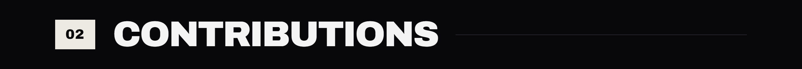

 

  

<b>Work, case studies, and the full story → <a href="https://web-portfolio-chi-steel.vercel.app">web-portfolio-chi-steel.vercel.app</a></b>

 

<b>Automation & CRM</b>

<b>AI & LLMs</b>

<b>Frontend</b>

<b>Backend & Data</b>

<b>Infra & Tooling</b>

 

